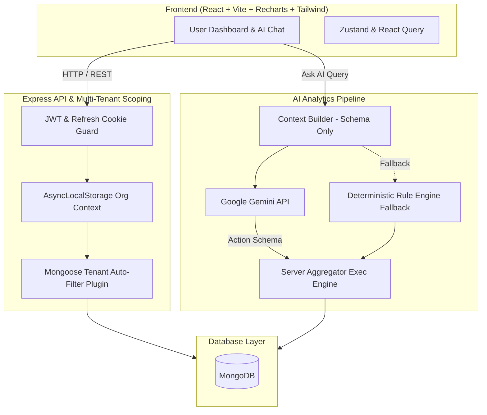

# 🚀 AI-Powered SaaS Analytics & BI Platform

[](LICENSE)
[](https://nodejs.org/)
[](https://reactjs.org/)
[](https://vitejs.dev/)
[](https://expressjs.com/)
[](https://www.mongodb.com/)
[](https://tailwindcss.com/)
[](https://ai.google.dev/)

An enterprise-grade, multi-tenant SaaS Business Intelligence (BI) and Data Analytics platform built with modern web technologies. This platform enables organizations to upload tabular datasets (CSV/Excel), perform natural-language AI data analysis, dynamically generate interactive visual dashboards, and collaborate securely across multi-tenant workspaces.

---

## 🌟 Key Features

### 1. 🔒 Zero-Leak Multi-Tenant Isolation
- **Contextual Context Binding**: Powered by Node.js `AsyncLocalStorage` and custom Mongoose plugins.
- **Automated Filter Injection**: Automatically appends `{ orgId }` constraints to all database queries (`find`, `count`, `aggregate`) database-side.
- **Fail-Safe Scoping**: Eliminates accidental cross-tenant data leakage structurally across all endpoints.

### 2. 🔑 Secure Authentication & Session Rotation
- **Stateless Dual-Token Auth**: Short-lived Access JWTs (15 min) paired with HTTP-only, secure Refresh Cookies (14 days).
- **Refresh Token Family Rotation**: SHA-256 hashed refresh tokens stored in DB with automatic family invalidation on reuse detection to prevent token theft.
- **OAuth 2.0 & RBAC**: Integrated Passport.js Google OAuth support and fine-grained Role-Based Access Control (`Owner`, `Admin`, `Member`).

### 3. 🤖 Ask AI Natural-Language Query Engine
- **Sandboxed Execution**: Raw dataset contents are never exposed to LLM APIs. Only dataset schemas, column metrics, and anonymized summary samples are shared.
- **Structured Action Constraints**: Constrains AI function-calling to strictly validated operations (`group_by`, `compare_periods`, `filter_and_aggregate`, `top_n`).
- **Deterministic Rule-Based Fallback**: Intelligent statistical fallback engine that operates seamlessly if LLM credentials are absent or rate-limited.
- **Rich Conversational Insights**: Generates plain-English narrative summaries, trend callouts, calculation methodology notes, and chart recommendations.

### 4. 📊 Automated Data Ingestion & Downsampling
- **Multi-Format Spreadsheet Parsing**: High-performance parsing for `.csv`, `.xlsx`, and `.xls` files up to 15MB.
- **Schema & Type Inference**: Automatically infers column data types (`string`, `number`, `date`, `boolean`) and flags anomalies.
- **Smart Data Downsampling**: Automatically caps and downsamples charts to max 100 data points server-side using time-skipping or categorical grouping ("Other") to maintain smooth browser performance.

### 5. 🧩 Drag-and-Drop Dashboard Workspace
- **Flexible Grid Layout**: Customizable drag-and-drop dashboard widgets built with `react-grid-layout` and `recharts`.
- **Dynamic Chart Pairing**: Automated heuristic recommendation engine that selects optimal chart types (`Bar`, `Line`, `Pie`, `KPI Cards`) based on data attributes.
- **Workspace Context Switching**: Allows users to seamlessly navigate between multiple organization profiles and dashboards.

---

## 🏗️ System Architecture



---

## 📁 Repository Directory Structure

```
.
├── backend/
│   ├── src/
│   │   ├── ai/            # Gemini & LLM function-calling tools & prompts
│   │   ├── analytics/     # Heuristic engines & aggregate calculators
│   │   ├── config/        # Passport OAuth & strategy configurations
│   │   ├── controllers/   # Route handlers (Auth, Org, Datasets, Analytics)
│   │   ├── middleware/    # Auth guards, AsyncLocalStorage tenant scoping
│   │   ├── models/        # User, Org, RefreshToken, DataSource, Dashboard schemas
│   │   ├── repositories/  # Database data access abstractions
│   │   ├── routes/        # API endpoints definitions
│   │   ├── services/      # File parsing, type inference, downsampling tools
│   │   ├── utils/         # Helper functions & JWT formatters
│   │   └── app.js         # Express server initializer
│   ├── tests/             # Integration & unit test suites (Jest + In-Memory Mongo)
│   ├── .env.example       # Backend environment variables blueprint
│   └── package.json
│
├── frontend/
│   ├── src/
│   │   ├── constants/     # API paths & app constants
│   │   ├── features/      # Modular UI features (ask-ai, analytics, dashboards, etc.)
│   │   ├── utils/         # Client-side formatters & helpers
│   │   ├── App.jsx        # Root application component & layout router
│   │   ├── index.css      # Custom dark glassmorphic styling tokens
│   │   └── main.jsx       # React application entry point
│   ├── .env.example       # Frontend environment variables blueprint
│   ├── package.json
│   ├── tailwind.config.js # Tailwind CSS configuration
│   └── vite.config.js     # Vite bundler setup & proxy rules
│
└── vercel.json            # Vercel deployment configuration
```

---

## 🛠️ Tech Stack

### Frontend
- **Framework**: [React 18](https://react.dev/) + [Vite](https://vitejs.dev/)
- **Styling**: [Tailwind CSS v4](https://tailwindcss.com/) + Custom Glassmorphism CSS
- **State Management**: [Zustand](https://github.com/pmndrs/zustand) & [TanStack React Query v5](https://tanstack.com/query)
- **Data Visualization**: [Recharts](https://recharts.org/)
- **Interactivity**: [Framer Motion](https://www.framer.com/motion/) & [React Grid Layout](https://github.com/react-grid-layout/react-grid-layout)
- **Forms & Validation**: [React Hook Form](https://react-hook-form.com/) & [Zod](https://zod.dev/)

### Backend
- **Runtime**: [Node.js](https://nodejs.org/) (v18+) & [Express.js](https://expressjs.com/)
- **Database**: [MongoDB](https://www.mongodb.com/) with [Mongoose ORM](https://mongoosejs.com/)
- **Authentication**: JWT (`jsonwebtoken`), `bcryptjs`, Cookie-Parser, Passport.js Google OAuth 2.0
- **AI Integration**: [@google/generative-ai (Gemini API)](https://ai.google.dev/)
- **File Processing**: `papaparse` (CSV) & `xlsx` (Excel)
- **Testing**: Jest, Supertest, Mongo In-Memory Server (`mongodb-memory-server`)

---

## 🚦 Getting Started

### Prerequisites
Make sure you have the following installed on your local development machine:
- **Node.js**: `v18.0.0` or higher
- **npm**: `v9.0.0` or higher
- **MongoDB**: Local instance or MongoDB Atlas cluster (Optional for running automated tests)

---

### Step 1: Clone the Repository
```bash
git clone https://github.com/manoj-kumar-b-dev/AI-powered-Analytics-Dashboard.git
cd AI-powered-Analytics-Dashboard
```

---

### Step 2: Backend Setup & Configuration

1. Navigate to the `backend` directory:
   ```bash
   cd backend
   ```

2. Install backend dependencies:
   ```bash
   npm install
   ```

3. Create your environment configuration file:
   ```bash
   cp .env.example .env
   ```

4. Configure your `.env` variables:
   ```env
   PORT=5000
   FRONTEND_URL=http://localhost:5173
   MONGO_URI=mongodb+srv://<username>:<password>@cluster.mongodb.net/analytics_db
   JWT_SECRET=your_super_secret_jwt_key
   GEMINI_API_KEY=your_google_gemini_api_key
   ```

5. Start the backend development server:
   ```bash
   npm run dev
   ```
   *The server will start on `http://localhost:5000`.*

---

### Step 3: Frontend Setup & Configuration

1. In a new terminal window, navigate to the `frontend` directory:
   ```bash
   cd frontend
   ```

2. Install frontend dependencies:
   ```bash
   npm install
   ```

3. Create frontend environment configuration:
   ```bash
   cp .env.example .env
   ```

4. Configure `.env` variables:
   ```env
   VITE_API_BASE_URL=http://localhost:5000
   ```

5. Start the Vite frontend development server:
   ```bash
   npm run dev
   ```
   *Open [http://localhost:5173](http://localhost:5173) in your browser.*

---

## 🧪 Running Tests

The backend includes full integration and unit test coverage powered by Jest and `mongodb-memory-server`.

```bash
cd backend
npm test
```

> [!NOTE]
> Tests run in-memory, requiring no active connection to an external MongoDB instance.

---

## 📡 API Reference Overview

### 🔐 Authentication (`/auth`)
| Method | Endpoint | Description |
| :--- | :--- | :--- |
| `POST` | `/auth/register` | Register new user & provision organization |
| `POST` | `/auth/login` | Authenticate user & issue httpOnly refresh cookie |
| `POST` | `/auth/refresh` | Rotate refresh token and issue fresh JWT |
| `POST` | `/auth/logout` | Revoke active refresh session |
| `GET`  | `/auth/me` | Fetch active user profile & organization list |
| `PUT`  | `/auth/switch-org` | Switch active workspace context |

### 🏢 Organization & Team (`/orgs`)
| Method | Endpoint | Description |
| :--- | :--- | :--- |
| `POST` | `/orgs/:orgId/invite` | Generate secure team invite token |
| `POST` | `/orgs/invite/accept` | Join organization via invite link |
| `GET`  | `/orgs/:orgId` | Fetch current organization details |

### 📂 Datasets & Ingestion (`/api/datasets`)
| Method | Endpoint | Description |
| :--- | :--- | :--- |
| `POST` | `/api/datasets` | Upload CSV/Excel dataset & perform schema inference |
| `GET`  | `/api/datasets` | List tenant datasets |
| `GET`  | `/api/datasets/:id/profile` | Preview dataset schema, row count & safe samples |
| `POST` | `/api/datasets/:id/ask` | Query dataset using natural-language AI prompt |

### 📈 Analytics & Dashboards (`/dashboards`)
| Method | Endpoint | Description |
| :--- | :--- | :--- |
| `POST` | `/dashboards` | Create customizable dashboard workspace |
| `GET`  | `/dashboards` | Fetch list of org dashboards |
| `GET`  | `/dashboards/:id` | Fetch board layout & live widget data |
| `PUT`  | `/dashboards/:id` | Update grid layout positions & widget configs |

---

## 🚢 Deployment

### Deploying on Vercel
The repository includes a root `vercel.json` configuration for seamless deployment:

1. Push your code to GitHub.
2. Connect your repository to [Vercel](https://vercel.com).
3. Set the Environment Variables (`MONGO_URI`, `JWT_SECRET`, `GEMINI_API_KEY`, etc.) in the Vercel Dashboard.
4. Deploy!

---

## 🤝 Contributing

Contributions are welcome! Follow these steps to contribute:

1. Fork the repository.
2. Create your feature branch (`git checkout -b feature/AmazingFeature`).
3. Commit your changes (`git commit -m 'Add some AmazingFeature'`).
4. Push to the branch (`git push origin feature/AmazingFeature`).
5. Open a Pull Request.

---

## 📄 License

Distributed under the MIT License. See `LICENSE` for more information.
